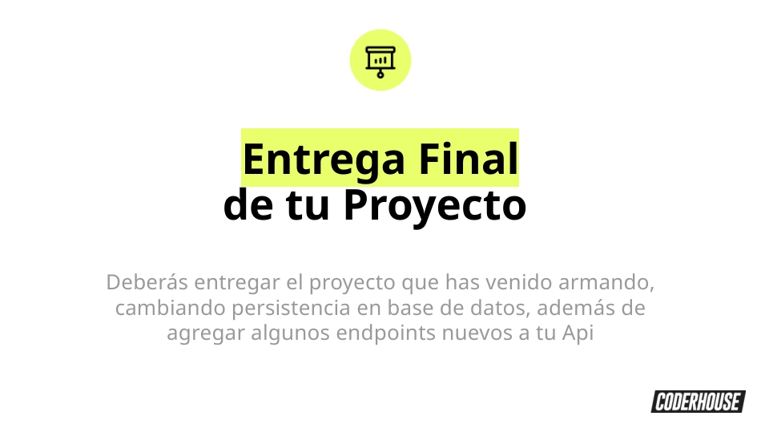
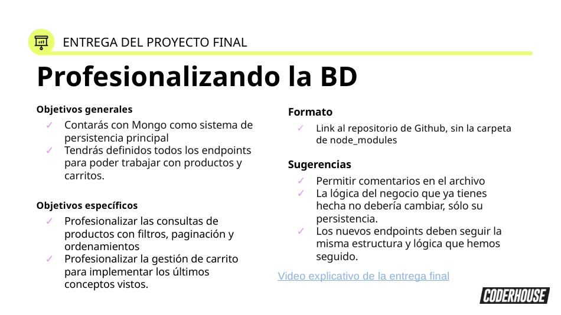
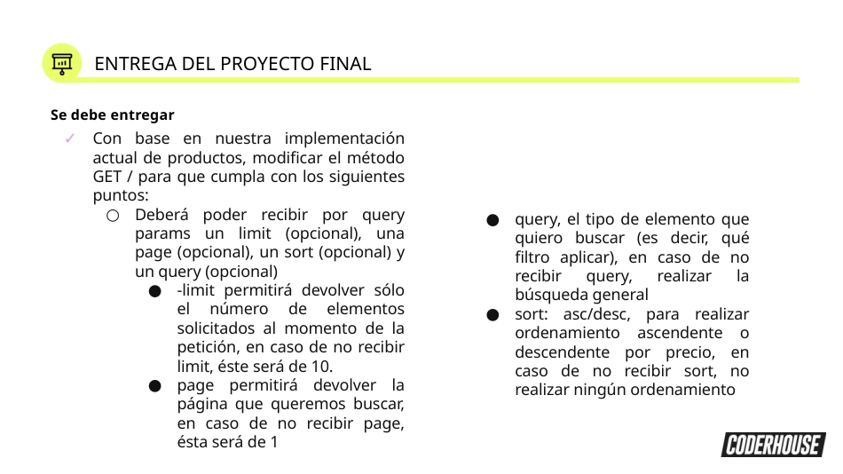
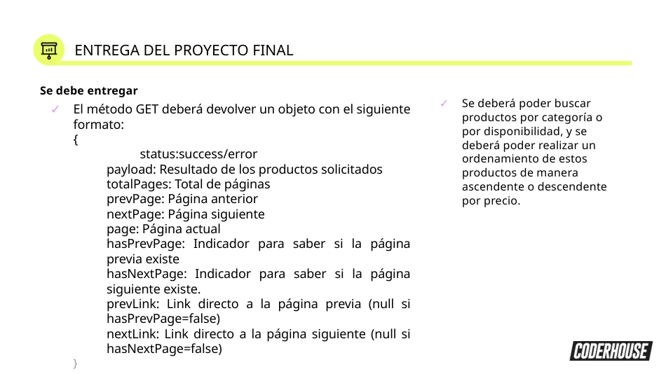
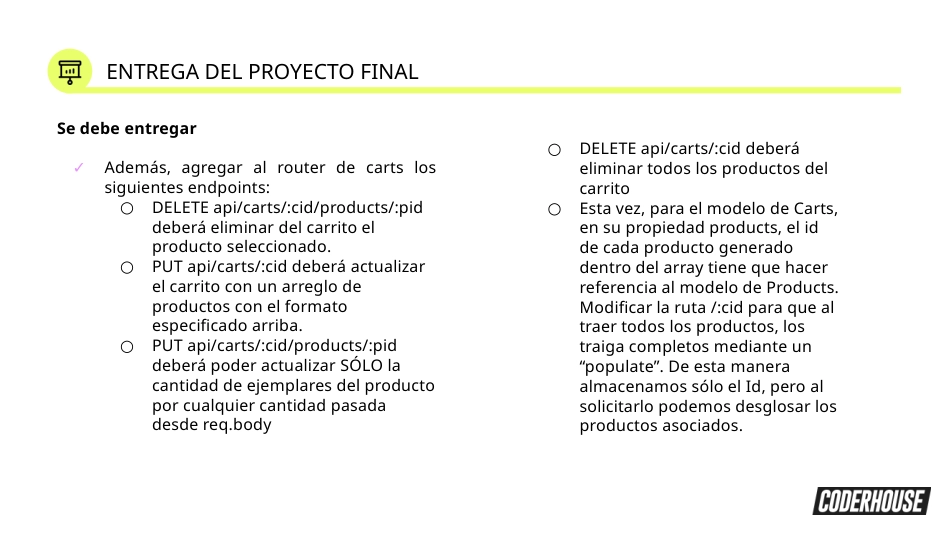
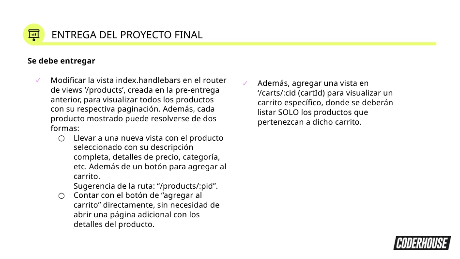

<div align="center" id="top"> 
  

&#xa0;

  <!-- <a href="https://backend_70065.netlify.app">Demo</a> -->
</div>
<!-- 
<h1 align="center">1era Pre-entrega - Backend_70065</h1>

<p align="center">
  

  

  

  
 -->
  <!--  -->

  <!--  -->

  <!--  -->
</p>

<!-- Status -->

<h4 align="center">
	  Backend_70065 🚀 Entrega Proyecto Final Backend Avanzado I...  
</h4>

<br>

## Entrega Proyecto Final

Integración de vistas, cambio de persisntencia fs a mongoose (mongoDB) y agregado de nuevos endpoints a la Api.

Se creo formulario en la vista realTimeProducts para agregar productos, y mostrar los productos en tiempo real, cada uno con un botón para eliminarlos, según las consignas establecidas.

Uso de métodos GET, PUT, DELETE, modificación de vista index.handlebars con limit, page, query, sort, devolviendo la data en el formato solicitado. todo según las siguientes consignas:

  <br>








### Organización: Estructura de Archivos

    BACKEND_70065-root/

```
└── 📁src
    └── 📁data
        └── carts.json
        └── products.json
    └── 📁fileManager
        └── carts.manager.js
        └── products.manager.js
    └── 📁models
        └── cart.model.js
        └── product.model.js
    └── 📁public
        └── 📁css
        └── 📁img
            └── avatar.png
            └── Consigna-01.webp
            └── Consigna-02.webp
            └── Consigna-03.webp
            └── Consigna-04.webp
            └── Consigna-05.webp
            └── Consigna-06.webp
        └── 📁js
            └── index.js
            └── view.index.js
        └── index.html
    └── 📁routes
        └── carts.router.js
        └── products.router.js
        └── views.router.js
    └── 📁views
        └── 📁layouts
            └── main.handlebars
        └── cart.handlebars
        └── index.handlebars
        └── product.handlebars
        └── realTimeProducts.handlebars
    └── app.js
    └── utils.js
```

### Creación de Router:

- productsRouter
- cartsRouter
- viewsRouter

### Implementación de rutas para obtener los productos y carritos

- GET /api/products
- GET /api/carts
- GET /products
- GET /products/:pid
- GET /carts
- GET /carts/:cid
- GET /realTimeProducts (con websocket)

### Routes:

Rutas creadas en directorio routes:

- carts.router.js
- products.router.js
- views.router.js

### Endpoints:

Configuración de router específico:

Productos: (/api/products):

Implementaron las siguientes rutas dentro del router de productos:

- GET /products - vista index.handlebars
- GET /api/products - Para obtener todos los productos (postman)

Ej: localhost:8080/api/products?category=Almohadas&sort=desc&availability=available

- DELETE /api/carts/:cid/products/:pid - Elimina del carrito el producto seleccionado

- PUT /api/carts/:cid - Actualiza el carrito con un arreglo de productos con el formato especificado

Ej:

Arreglo de productos enviados desde el body con el siguiente formato:

```
{
  "products": [
    { "product": "66ba7985e522c403f9e16b8a", "quantity": 19 },
    { "product": "66ba742770d72511dca929db", "quantity": 21 }
  ]
}
```

PUT /api/carts/:cid/products/:pid - Actualiza solo la cantidad de productos, por cualquier cantidad pasada desde req.body

Ej:

Cantidad pasada desde rep.body con el siguiente formato:

```
{  "quantity": 15 }
```

DELETE /api/carts/:cid - Elimina todos los productos del carrito.

GET /api/carts/:cid - Permite ver todas las porpiedades de cada producto en el carrito especificado mediante un populate. Aunque en el arreglo de products en el carrito solo se almacene el id y la cantidad.

Ej:

localhost:8080/api/carts/66bd93903f5245b16c42369e

```
{
    "status": "success",
    "payload": {
        "_id": "66bd93903f5245b16c42369e",
        "first_name": "Cecilia",
        "last_name": "Trump",
        "email": "ctrump@mail.com",
        "products": [
            {
                "product": {
                    "_id": "66ba7985e522c403f9e16b8a",
                    "title": "Almohadon Duvet King Premium",
                    "description": "Almohada de duvet tamaño 50x90 rellena de con duvet 850 FP",
                    "code": "AL85050x90P",
                    "price": 300000,
                    "status": true,
                    "stock": 46,
                    "category": "Almohadas",
                    "__v": 0
                },
                "quantity": 10,
                "_id": "66be8673bebdb78eb834194f"
            },
            {
                "product": {
                    "_id": "66ba742770d72511dca929db",
                    "title": "Almohadon Duvet King Premium Soft",
                    "description": "Almohada de duvet tamaño 50x90 rellena de con duvet 850 FP",
                    "code": "AL85050x90PS",
                    "price": 150000,
                    "status": true,
                    "stock": 30,
                    "category": "Almohadas",
                    "thumbnails": []
                },
                "quantity": 15,
                "_id": "66be8673bebdb78eb8341950"
            }
        ],
        "timestamp": "2024-08-15T05:35:12.450Z",
        "__v": 2
    }
}
```

### Vista

#### index.handlebars

Vista modificada para mostrar los productos y sus caracteristicas de la coleccion de products en mongo, cada producto con su botón para agregar al carrito, trabajando con script en view.index.js (/src/public/js/view.index.js)

#### Vista para '/carts/:cid'

Se creó la vista cart.handlebars para visualizar los productos pertenecientes a un carrtio especifico.

### Persistencia:

Conexión con mongoose (mongoDB)

### Configuración WebSocket

- Servidor: app.js
- Script: index.js
- Vista:
  - realTimeProducts.handlebars

### Configuración Handlebars

### Vistas:

- index.handlebars (lista productos de la colección products en la base de datos con botón de Agregar al carrito)
  Ruta: '/products'

- cart.handlebars (Lista los producto pertenecientes a un carrito)
  Ruta: 'carts/:cid'

- realTimeProducts.handlebars (Form y Lista productos en tiempo real)
  Ruta: '/realTimeProducts'

<br>

### Technologias

Tecnologías utilizadas:

- [Git](https://git-scm.com)
- [Node.js](https://nodejs.org/en/)
- [ExpressJS](https://expressjs.com/)
- [express-handlebars](https://github.com/express-handlebars)
- [socket.io](https://socket.io/)
- [Mongoose](https://mongoosejs.com/)
- [Mongoose-paginate-v2](https://www.npmjs.com/package/mongoose-paginate-v2)

<br>

## Requirimientos

Antes de iniciar, debes tener instalado: [Git](https://git-scm.com), [Node](https://nodejs.org/en/), [ExpressJS](https://expressjs.com/), [express-handlebars](https://github.com/express-handlebars), [socket.io](https://socket.io/), [Mongoose](https://mongoosejs.com/) y [Mongoose-paginate-v2](https://www.npmjs.com/package/mongoose-paginate-v2).

## Iniciando

```bash
# Clonar este proyecto
$ git clone https://github.com/Joamilibar/backend_70065.git

# Acceso
$ cd backend_70065

# Instalar dependencias
$ npm init

# Iniciar servidor
$ npm start

# El servidor inicia en: <http://localhost:8080>
```

## License

#### Pública

<!-- This project is under license from MIT. For more details, see the [LICENSE](LICENSE.md) file. -->

by <a href="https://github.com/Joamilibar/backend_70065" target="_blank">`Joamil Ibarra`</a>

&#xa0;

<a href="#top">Back to top</a>
