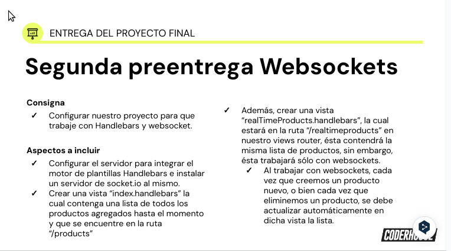
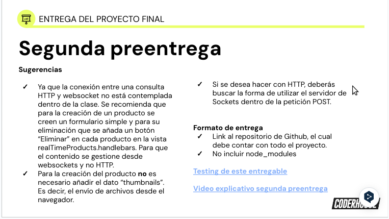

<div align="center" id="top"> 
  

&#xa0;

  <!-- <a href="https://backend_70065.netlify.app">Demo</a> -->
</div>
<!-- 
<h1 align="center">1era Pre-entrega - Backend_70065</h1>

<p align="center">
  

  

  

  
 -->
  <!--  -->

  <!--  -->

  <!--  -->
</p>

<!-- Status -->

<h4 align="center">
	  Backend_70065 🚀 2da Pre-entrega...  
</h4>

<br>

## 2da Pre-entrega de Proyecto Final

Integraciónb de vistas y sockets al servidor actual(1era pre-entrega).

Se creo formulario en la vista realTimeProducts para agregar productos, y mostrar los productos en tiempo real, cada uno con un botón para eliminarlos, según las consignas establecidas.

- Servidor Express con escucha en puerto 8080

  <br>




### Organización: Estructura de Archivos

    BACKEND_70065-root/

```
└── 📁src
    └── app.js
    └── 📁data
        └── carts.json
        └── products.json
    └── 📁fileManager
        └── carts.manager.js
        └── products.manager.js
    └── 📁public
        └── 📁css
        └── 📁img
            └── consigna1.png
            └── consigna2.png
        └── index.html
        └── 📁js
            └── index.js
            └── realtimeproducts.js
    └── 📁routes
        └── carts.router.js
        └── products.router.js
        └── views.router.js
    └── utils.js
    └── 📁views
        └── index.handlebars
        └── 📁layouts
            └── main.handlebars
        └── realTimeProducts.handlebars
```

### Creación de Router:

- productsRouter
- cartsRouter
- viewsRouter

### Implementación de rutas para obtener los productos y carritos

- GET /api/products
- GET /api/carts
- GET /products (sin websocket)
- GET /realTimeProducts (con websocket)

### Routes:

Rutas creadas en directorio routes:

- carts.router.js
- products.router.js
- views.router.js

### Endpoints:

Configuración de router específico:

Productos: (/api/products):

Implementaron las siguientes rutas dentro del router de productos:

- GET /products: para listar los productos sin websocket
- GET /api/products: Para obtener todos los productos.
- GET /api/products/:pid: Para obtener un producto específico por su id (pid).
- POST /api/products: Para agregar productos.
- POST /api/products/:pid: Acualizar/Modificar productos por id.
- DELETE /api/products/:pid: Para elminar producto por id.

Carts: (/api/carts)

- GET /api/carts: Para listar carritos.
- GET /api/carts/:cid: Para obtener carrito por id y listar productos.
- POST /api/carts: Para agregar nuevo carrito.
- POST /api/carts/:cid/products/:pid: Para agregar producto a carrito por id.

Manejo de Datos:

### Persistencia:

Archivos File System creados en directorio fileManager:

- products.manager.js
- carts.manager.js

Funciones asincronas:

- async readFile
- async writeFile

### Configuración WebSocket

- Servidor: app.js
- Cliente: index.js
- Vista: realTimeProducts.handlebars

### Configuración Handlebars

Vistas:

- index.handlebars (lista productos agregados. Ruta: "/products")
- realTimeProducts.handlebars (Form y Lista productos en tiempo real. Ruta: "/realTimeProducts")

<br>

```


```

### Technologias

Tecnologías utilizadas:

- [Git](<[Git](https://git-scm.com)>)
- [Node.js](https://nodejs.org/en/)
- [ExpressJS](https://expressjs.com/)
- [express-handlebars](https://github.com/express-handlebars)
- [socket.io](https://socket.io/)

<br>

## Requirimientos

Antes de iniciar, debes tener instalado: [Git](https://git-scm.com), [Node](https://nodejs.org/en/), [ExpressJS](https://expressjs.com/), [express-handlebars](https://github.com/express-handlebars) y [socket.io](https://socket.io/).

## Iniciando

```bash
# Clonar este proyecto
$ git clone https://github.com/Joamilibar/backend_70065.git

# Acceso
$ cd backend_70065

# Instalar dependencias
$ npm init

# Iniciar servidor
$ npm start

# El servidor inicia en: <http://localhost:8080>
```

## Video

[2da Pre-entrega_70065](https://www.loom.com/share/d792549ee4dc44cbae15693c766f4777?sid=cfb7597a-5a65-4f5f-8fb3-d063d182e27c)

## License

#### Pública

<!-- This project is under license from MIT. For more details, see the [LICENSE](LICENSE.md) file. -->

by <a href="https://github.com/Joamilibar" target="_blank">`Joamil Ibarra`</a>

&#xa0;

<a href="#top">Back to top</a>
